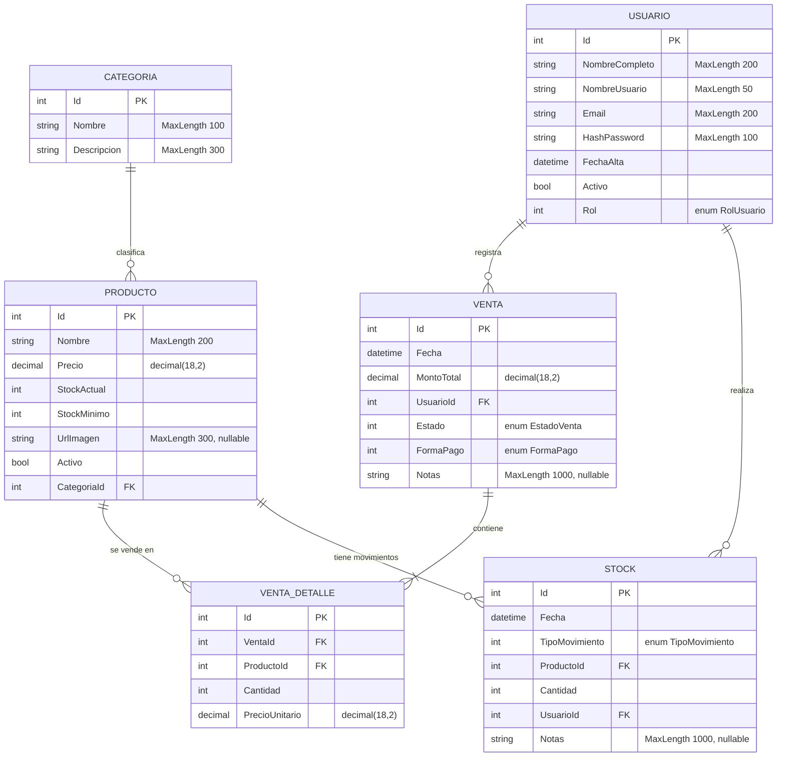

# Modelo relacional - PuntoVenta

Generado a partir de `PuntoVenta.Shared/Entities`.

## Notas

- `VentaDetalle.MontoTotal` es una propiedad calculada (`Cantidad * PrecioUnitario`) que solo tiene getter. EF Core no la mapea a una columna, por eso no aparece en el diagrama.
- `VentaDetalle` tiene `VentaId` como FK, pero le falta la propiedad de navegación `Venta`. La relación existe igualmente por el `[ForeignKey("Venta")]` y por la colección en `Venta`.
- Los enums (`RolUsuario`, `EstadoVenta`, `FormaPago`, `TipoMovimiento`) se guardan como `int` en la base de datos.
